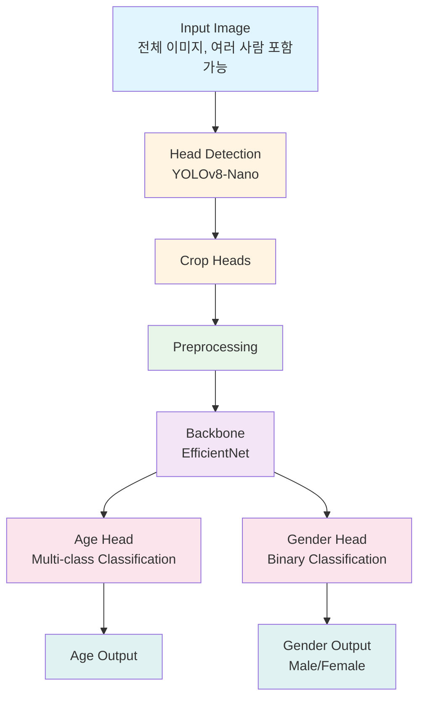

# Age & Gender Estimation System

## 프로젝트 개요

이 프로젝트는 실제 키오스크 환경에서 수행한 나이/성별 추정 시스템의 포트폴리오 버전입니다.

**중요**: 이 프로젝트는 실제 상용 코드, 모델 가중치, 데이터를 포함하지 않으며, 구조와 설계 철학만 참고하여 완전히 새로 구현되었습니다.

## Task 정의

이 시스템은 얼굴 이미지로부터 다음 두 가지를 동시에 예측합니다:

1. **Age Estimation**: Multi-class classification (0~100세, 1세 단위, 총 101 classes)
2. **Gender Classification**: Binary classification (Male / Female)

두 작업을 하나의 모델에서 Multi-Head 구조로 동시에 학습하여 효율적인 추론을 가능하게 합니다.

### 나이 예측 정확도 평가

나이 예측 정확도는 예측값과 실제값의 차이를 기준으로 측정합니다:
- **±1세 범위**: 예측값이 실제값의 ±1세 범위 내에 있는 비율
- **±3세 범위**: 예측값이 실제값의 ±3세 범위 내에 있는 비율
- **±5세 범위**: 예측값이 실제값의 ±5세 범위 내에 있는 비율 (채택)
- **±10세 범위**: 예측값이 실제값의 ±10세 범위 내에 있는 비율
- **±15세 범위**: 예측값이 실제값의 ±15세 범위 내에 있는 비율

실험 결과, **±5세 범위**에서 가장 높은 정확도를 보여 이를 최종 평가 기준으로 채택했습니다.

## 전체 파이프라인



## 모델 구조 설명

### Backbone Network

- **EfficientNet** 계열을 사용하여 얼굴 이미지로부터 공유 feature를 추출합니다.
- ImageNet 사전 학습 가중치를 활용하여 빠른 수렴과 좋은 성능을 달성합니다.
- Backbone은 Age와 Gender 두 작업에 공통으로 사용됩니다.

### Multi-Head Architecture

1. **Age Head**
   - Backbone의 feature를 입력으로 받아 나이를 분류합니다.
   - 0~100세를 1세 단위로 분류 (총 101 classes).
   - 출력: 각 나이(0~100)에 대한 확률 분포

2. **Gender Head**
   - 동일한 Backbone feature를 사용하여 성별을 분류합니다.
   - Binary classification (Male / Female)
   - 출력: 성별 확률

### 설계 철학

- **Shared Backbone**: 두 작업이 공통 feature를 공유하여 효율적인 학습과 추론
- **Multi-Task Learning**: 나이와 성별을 동시에 학습하여 서로 도움을 주는 효과
- **동시 추론**: 하나의 forward pass로 나이와 성별을 동시에 예측
- **Lightweight Design**: Edge device 배포를 고려한 경량화 구조

### 학습 방식

나이와 성별이 동시에 추론되도록 훈련됩니다:

1. **Forward Pass**: 하나의 이미지 입력으로 Backbone을 통과하여 공유 feature 추출
2. **동시 예측**: 공유 feature를 Age Head와 Gender Head에 동시에 전달하여 두 예측을 동시에 수행
3. **Loss 계산**: Age loss와 Gender loss를 각각 계산 후 가중합으로 결합
4. **Backward Pass**: 한 번의 backward pass로 Backbone과 두 Head를 동시에 업데이트

## 데이터 구성 방식

### 데이터셋 구조

```
data/
├── README.md          # 데이터 사용 방법 설명
└── sample/           # 예시용 샘플 이미지
    ├── images/       # 얼굴 이미지 파일
    └── annotations/  # 라벨 파일 (선택사항)
```

### 데이터 형식

- **이미지**: JPG, PNG 형식 지원
- **Annotation**: CSV 또는 JSON 형식
  - 형식 예시: `image_path, age, gender`
  - `age`: 정수 (0-100, 1세 단위)
  - `gender`: 0 (Male) 또는 1 (Female)

### 권장 공개 데이터셋

- **UTKFace**: 나이, 성별, 인종 라벨 포함
- **FairFace**: 다양한 인종과 연령대 포함
- **IMDB-WIKI**: 대규모 얼굴 데이터셋

**참고**: 실제 학습 데이터는 포함되어 있지 않습니다. 사용자는 위 공개 데이터셋을 다운로드하여 `data/` 디렉토리에 배치해야 합니다.

## 설치 및 환경 설정

### 요구사항

- Python 3.10+
- PyTorch 1.12+
- CUDA (GPU 사용 시, 선택사항)

### 설치

```bash
# 저장소 클론
git clone <repository-url>
cd age_gender_estimation

# 가상환경 생성 (권장)
python -m venv venv
source venv/bin/activate  # Windows: venv\Scripts\activate

# 의존성 설치
pip install -r requirements.txt
```

## 사용 예시

### 학습 (Training)

```bash
# 기본 학습 실행
python train.py --config configs/config.yaml

# 커스텀 설정으로 학습
python train.py --config configs/config.yaml --batch-size 32 --epochs 50
```

### 추론 (Inference)

#### 기본 추론 (얼굴 이미지 직접 입력)

```bash
# 단일 이미지 추론
python inference.py --image ./data/sample/test.jpg

# 폴더 내 모든 이미지 추론
python inference.py --source ./data/sample/images/ --output results/

# 모델 가중치 지정
python inference.py --image test.jpg --weights weights/best_model.pt
```

#### Head Detection 포함 추론 (전체 이미지에서 머리 검출 후 추론)

```bash
# Head Detection + Age & Gender Estimation
python inference_with_detection.py \
    --age-gender-weights weights/best_model.pt \
    --image ./data/sample/test.jpg \
    --output results/

# 폴더 내 모든 이미지 처리
python inference_with_detection.py \
    --age-gender-weights weights/best_model.pt \
    --source ./data/sample/images/ \
    --output results/
```

### Head Detection (YOLO)

#### 학습

```bash
# Head Detection 모델 학습
python detection/train_detector.py \
    --data data/detection/dataset.yaml \
    --model yolo11n.pt \
    --epochs 100 \
    --imgsz 640 \
    --batch 16
```

#### 검증

```bash
# Head Detection 모델 검증
python detection/val_detector.py \
    --model weights/detection/best.pt \
    --data data/detection/dataset.yaml
```

#### 추론 (Head Detection만)

```bash
# Head Detection만 수행 (crop된 머리 이미지 저장)
python detection/predict_detector.py \
    --model weights/detection/best.pt \
    --source ./data/sample/images/ \
    --output results/detection
```

### 평가 (Evaluation)

```bash
# 검증 데이터셋으로 평가
python evaluation.py --config configs/config.yaml --weights weights/best_model.pt

# Age Accuracy (±5세 범위), Gender Accuracy 출력
python evaluation.py --config configs/config.yaml --weights weights/best_model.pt --split test
```

### ONNX Export

```bash
# PyTorch 모델을 ONNX로 변환
python export_onnx.py --weights weights/best_model.pt --output model.onnx

# Edge device용 최적화 옵션
python export_onnx.py --weights weights/best_model.pt --output model.onnx --opset-version 11
```

## 설정 파일

모든 하이퍼파라미터와 경로 설정은 `configs/config.yaml`에서 관리됩니다.

주요 설정 항목:
- 모델 구조 (backbone, head 설정)
- 학습 파라미터 (batch_size, learning_rate, epochs)
- 데이터 경로
- Age classes (0~100세, 101 classes)
- Augmentation 설정
- 평가 범위 (±5세 범위 정확도)

## 프로젝트 구조

```
age_gender_estimation/
├── README.md                 # 프로젝트 개요 및 사용법
├── requirements.txt          # Python 패키지 의존성
├── configs/
│   └── config.yaml          # 설정 파일
├── data/
│   ├── README.md            # 데이터 사용 방법
│   └── sample/              # 예시 샘플 이미지
├── models/
│   ├── __init__.py
│   ├── backbone.py          # Backbone 네트워크 정의
│   ├── age_head.py          # Age classification head
│   ├── gender_head.py       # Gender classification head
│   └── network.py           # 전체 네트워크 (Backbone + Heads)
├── preprocess/
│   └── transforms.py        # 전처리 및 Augmentation
├── train.py                 # 학습 스크립트
├── inference.py             # 추론 스크립트 (얼굴 이미지 직접 입력)
├── inference_with_detection.py  # 통합 추론 스크립트 (Head Detection 포함)
├── evaluation.py            # 평가 스크립트
├── export_onnx.py           # ONNX 변환 스크립트
├── detection/               # Head Detection 모듈
│   ├── train_detector.py   # YOLO head detection 학습
│   ├── val_detector.py     # YOLO head detection 검증
│   └── predict_detector.py # YOLO head detection 추론
└── docs/
    ├── pipeline_diagram.md  # 파이프라인 상세 다이어그램
    └── optimization_notes.md # 최적화 노트
```

## ONNX Export 및 Edge Inference

이 프로젝트는 ONNX 형식으로 모델을 변환하여 다양한 플랫폼에서 사용할 수 있도록 지원합니다.

### ONNX 변환의 장점

1. **플랫폼 독립성**: PyTorch 외의 런타임에서도 실행 가능
2. **최적화**: ONNX Runtime을 통한 추론 최적화
3. **Edge 배포**: 모바일, 임베디드 디바이스에서 실행 가능

실제 Edge 배포는 포트폴리오 재현 수준으로 구현되며, 실제 상용 배포 환경과는 다를 수 있습니다.

## Head Detection

이 프로젝트는 [Ultralytics YOLO](https://docs.ultralytics.com/ko/modes/train/)를 사용하여 human head detection 기능을 제공합니다.

### 주요 기능

- **YOLO 기반 Detection**: YOLO모델을 사용한 머리 검출
- **자동 Crop**: 검출된 머리 영역을 자동으로 crop하여 Age & Gender Estimation에 사용
- **통합 파이프라인**: Head Detection → Crop → Age & Gender Estimation을 한 번에 수행

### 사용 방법

1. **Head Detection 모델 학습**:
   ```bash
   python detection/train_detector.py --data data/detection/dataset.yaml
   ```

2. **통합 추론** (권장):
   ```bash
   python inference_with_detection.py \
       --age-gender-weights weights/best_model.pt \
       --image test.jpg
   ```

자세한 내용은 [data/detection/README.md](data/detection/README.md)를 참조하세요.

## Legal Notice

**중요**: 이 프로젝트는 실제 상용 코드, 모델 가중치, 데이터를 포함하지 않습니다. 모든 코드, 모델 구조, 설정은 포트폴리오 목적으로 새로 작성되었으며, 실제 상용 시스템과의 유사성은 구조적 아이디어에 한정됩니다.