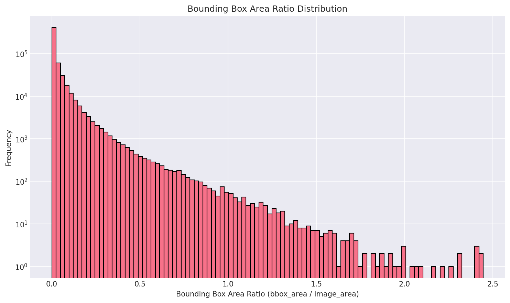
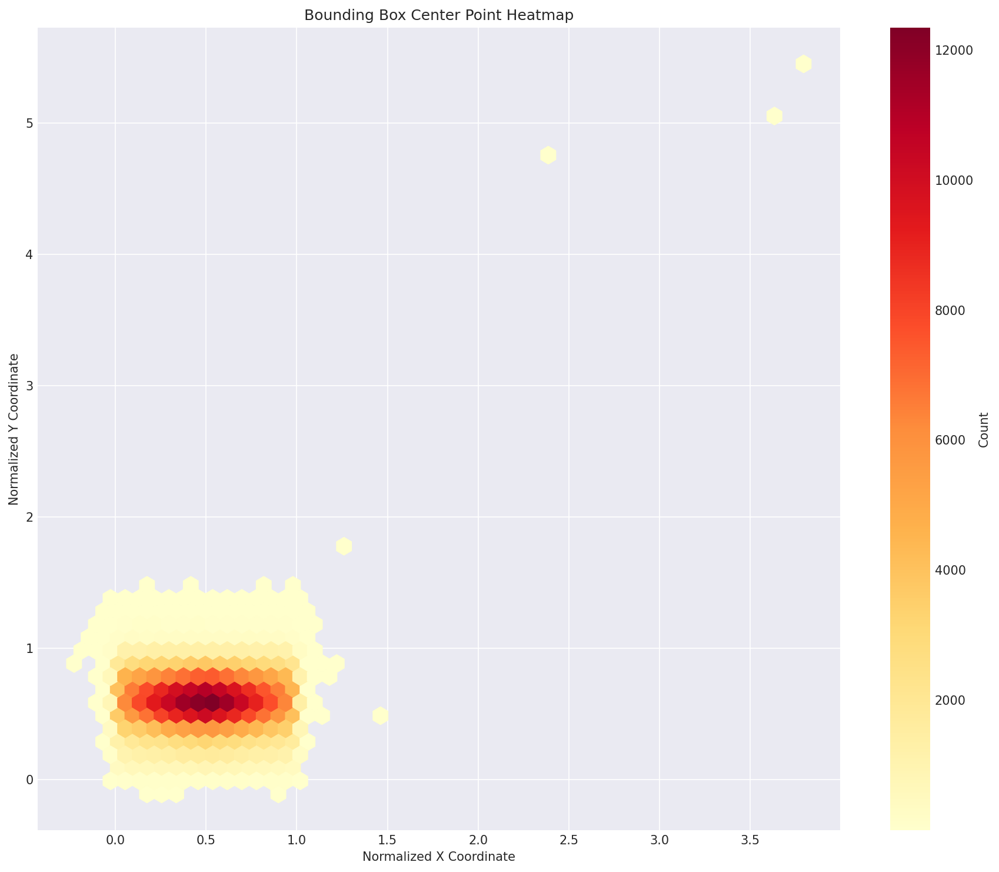
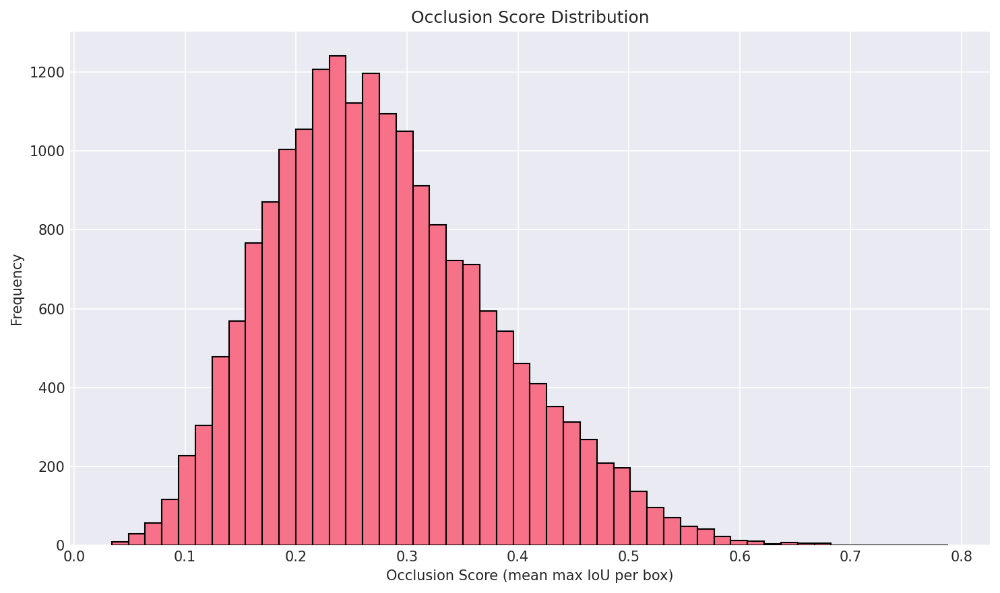
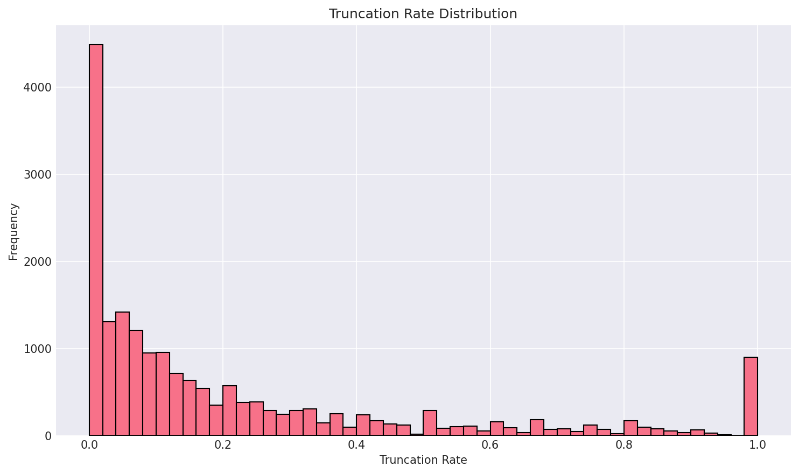
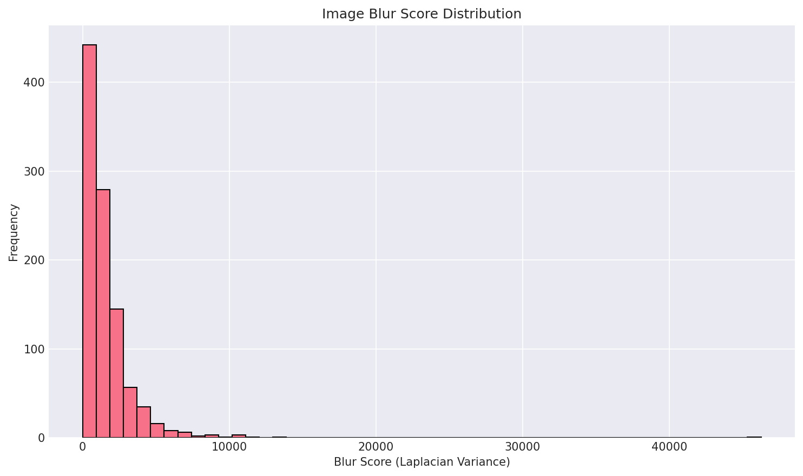
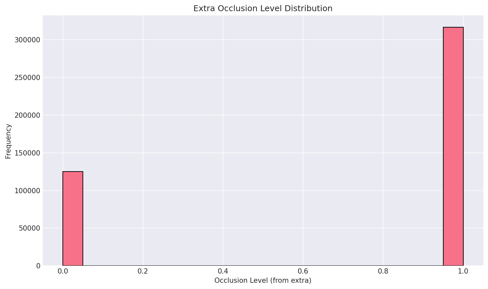
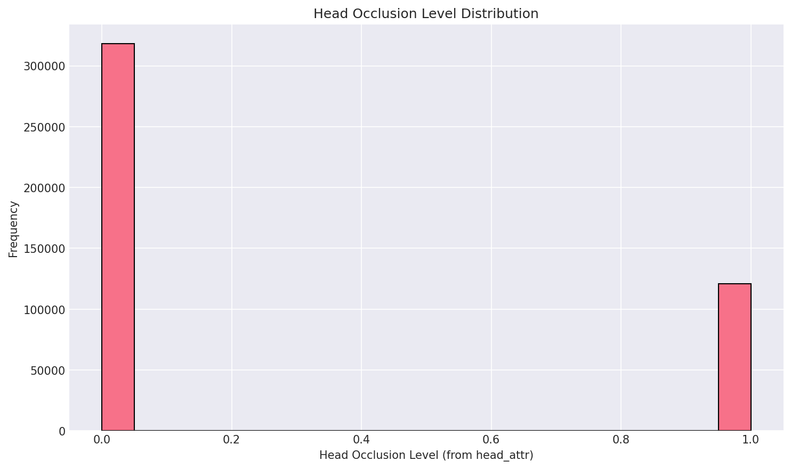
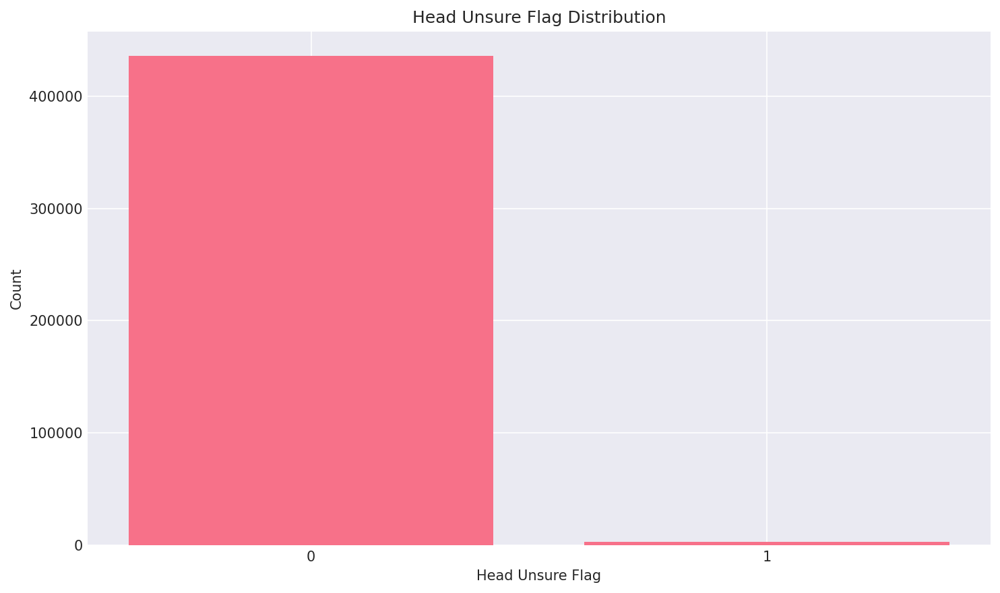

# CrowdHuman Dataset EDA Summary

- This is the EDA summary of the CrowdHuman dataset.
- Link : https://www.crowdhuman.org/download.html

## Dataset Overview
- **Total Images**: 19,370
- **Total Objects**: 566,508
- **Average Objects per Image**: 29.25

## Class Distribution
- **Person**: 456,098 (80.5%)
- **Mask**: 110,410 (19.5%)

*This plot shows the distribution of object classes in the dataset. The "person" class represents individual person detections, while "mask" represents crowd regions or other person-like objects that should be ignored during training.*

**Analysis**: The dataset has a significant class imbalance with ~80% person and ~20% mask annotations. This imbalance suggests that most annotations are valid person detections, while mask annotations (crowd regions) are less frequent but still substantial. During training, ensure proper handling of mask annotations to avoid false positives from crowd regions.

## Object Characteristics
- **Small Object Ratio** (<1% of image area): 57.0%
- **Average Occlusion Score**: 0.279
- **Average Truncation Rate**: 21.9%

*Distribution of the number of objects per image. This histogram reveals the crowd density characteristics of the dataset, showing how many images contain few vs. many objects.*

**Analysis**: The distribution shows a right-skewed pattern typical of crowded scene datasets. Most images contain moderate numbers of objects, but there's a long tail with some images containing hundreds of objects. This extreme variation in object count requires robust training strategies that can handle both sparse and extremely dense scenes. The high maximum (391 objects) indicates severe crowding scenarios that will challenge detection models.

*Histogram showing the ratio of bounding box area to total image area. Values closer to 0 indicate small objects, while values closer to 1 indicate objects that occupy most of the image. The log scale helps visualize the long tail of small objects.*

**Analysis**: The log-scale histogram reveals a heavy concentration of small objects (area ratio < 0.01), which aligns with the 57% small object ratio. This distribution indicates that the dataset contains many distant or partially visible people, making small object detection critical. The long tail suggests significant scale variation, requiring multi-scale feature extraction and appropriate anchor box design. Models must be capable of detecting objects spanning several orders of magnitude in size.

*Distribution of bounding box aspect ratios (width/height). Values < 1 indicate taller objects (typical for standing people), while values > 1 indicate wider objects. This helps understand object shape characteristics.*

**Analysis**: The distribution shows a strong peak below 1.0, confirming that most bounding boxes are taller than they are wide, which is expected for standing people. The mean aspect ratio of ~0.58 indicates people are typically about 1.7 times taller than wide. However, there's variation including some wider boxes (possibly groups, sitting people, or partial views). This information is useful for designing anchor box aspect ratios and understanding pose variations in the dataset.

## Spatial Distribution

*Heatmap showing the spatial distribution of bounding box center points across normalized image coordinates. Warmer colors indicate regions with higher object density. This reveals where objects tend to be located in images (e.g., center vs. edges).*

**Analysis**: The heatmap reveals spatial bias in object locations. If objects cluster in the center, it suggests images are typically framed with people in the middle. If objects are distributed more evenly, it indicates diverse scene compositions. Edge clustering might indicate truncation or people entering/exiting frames. Understanding this spatial distribution helps with data augmentation strategies (e.g., whether to use center cropping) and can inform where to focus detection efforts during inference.

## Crowding & Occlusion Analysis

*Distribution of Intersection over Union (IoU) values between pairs of bounding boxes in the same image. Higher IoU values indicate more overlapping objects, which is characteristic of crowded scenes. This metric helps quantify the level of occlusion in the dataset.*

**Analysis**: The IoU distribution shows the pairwise overlap characteristics. A distribution heavily skewed toward 0 indicates mostly non-overlapping objects, while higher IoU values indicate severe crowding. The mean IoU of ~0.01 suggests most object pairs don't overlap significantly, but the maximum IoU near 1.0 indicates some extreme cases of near-complete overlap. This pattern is typical for crowded scenes where most people are separate but some groups are tightly packed. High IoU cases will challenge NMS algorithms and may require specialized handling.

*Distribution of occlusion scores per image, calculated as the mean of maximum IoU values for each bounding box. Higher scores indicate images with more severe occlusion, where objects heavily overlap with each other.*

**Analysis**: The occlusion score distribution shows how occlusion severity varies across images. An average score of ~0.28 indicates moderate occlusion levels overall. If the distribution is right-skewed, most images have low occlusion but some have severe cases. If it's more uniform, occlusion is consistently moderate across the dataset. Images with high occlusion scores (>0.5) will be particularly challenging and may benefit from specialized training techniques or post-processing. This metric helps identify which images might need special attention during training or validation.

*Distribution of truncation rates per image, showing the proportion of bounding boxes that extend beyond image boundaries. Higher truncation rates indicate more objects are partially cut off at image edges.*

**Analysis**: The truncation rate distribution reveals how often objects are cut off at image boundaries. An average truncation rate of ~22% indicates that about one-fifth of objects are partially outside the frame. If the distribution shows many images with high truncation (>50%), it suggests the dataset contains many edge cases where people are entering/exiting frames. This is common in surveillance or street scene datasets. High truncation requires careful handling during training to avoid penalizing valid but partial detections, and may necessitate special loss functions or evaluation metrics that account for truncation.

## Crowd Density Distribution
- **Sparse** (<5 objects): 3.2%
- **Medium** (5-14 objects): 32.4%
- **Dense** (15-29 objects): 31.3%
- **Extreme** (≥30 objects): 33.1%

*Bar chart showing the distribution of images across different crowd density levels. This classification helps understand the dataset composition and identify which density levels are most common.*

**Analysis**: The density distribution shows a relatively balanced split across medium, dense, and extreme categories (~32-33% each), with sparse images being rare (~3%). This balanced distribution is beneficial for training as the model will see diverse crowd scenarios. However, the high proportion of extreme density images (33%) means the model must be robust to very crowded scenes. The near-equal distribution suggests the dataset is well-designed for crowd detection tasks, but the scarcity of sparse images might make the model less robust to scenes with few people. Consider data augmentation or targeted sampling to ensure sparse scenarios are adequately represented.

## Image Quality Analysis

*Distribution of image brightness values calculated as the mean grayscale intensity. This helps identify if the dataset has consistent lighting conditions or contains images with varying brightness levels (e.g., indoor vs. outdoor scenes).*

**Analysis**: The brightness distribution reveals lighting conditions across the dataset. A narrow distribution suggests consistent lighting (e.g., all outdoor daytime scenes), while a wide distribution indicates diverse conditions (indoor/outdoor, day/night, various weather). The mean brightness of ~113 (on 0-255 scale) suggests generally well-lit scenes, but variation indicates the dataset includes different lighting scenarios. This diversity is beneficial for generalization but may require normalization or adaptive preprocessing. If the distribution is bimodal, it might indicate distinct indoor/outdoor subsets that could benefit from domain adaptation techniques.

*Distribution of blur scores calculated using Laplacian variance. Higher values indicate sharper images, while lower values indicate blurrier images. This metric helps assess image quality and identify potential data quality issues.*

**Analysis**: The blur score distribution indicates image sharpness quality. A distribution with most values above 100 typically indicates sharp images suitable for detection. Very low scores (<50) suggest motion blur or poor focus, which can degrade detection performance. The mean blur score and standard deviation reveal overall image quality. If there's a significant tail of low blur scores, those images may need special handling or could be candidates for exclusion or deblurring preprocessing. High variance in blur scores suggests inconsistent image quality that might benefit from quality-based sampling or augmentation strategies.

## Annotation Attributes Analysis

*Distribution of ignore flags from the "extra" attribute. Value 0 means the object should be used for training, while 1 means it should be ignored (e.g., crowd regions, reflections, or other non-person objects).*

**Analysis**: The ignore flag distribution shows the proportion of annotations that should be excluded from training. If most flags are 0, the dataset has high-quality annotations. If a significant portion is 1, it indicates many ambiguous cases (crowds, reflections, etc.) that annotators marked for exclusion. This is important for training - ensure your data loader properly filters ignored annotations to avoid learning from invalid examples. The ratio of ignored to non-ignored annotations also affects the effective dataset size and class balance.

*Distribution of occlusion levels from the "extra" attribute. This shows the annotated occlusion severity for each object, providing ground truth occlusion information beyond what can be inferred from bounding box overlaps.*

**Analysis**: The occlusion level distribution from annotations provides ground truth occlusion information. The mean occlusion level of ~0.72 (if on a 0-1 scale) indicates significant occlusion in the dataset. This annotation-level occlusion data is more accurate than IoU-based estimates because annotators can identify occlusion even when bounding boxes don't overlap (e.g., objects behind others). Understanding the distribution helps with training strategies - highly occluded objects might need different loss weights or could be used for occlusion-aware training. The distribution pattern (uniform vs. skewed) reveals whether occlusion is consistent or varies dramatically across objects.

*Distribution of ignore flags for head annotations from the "head_attr" attribute. This indicates which head bounding boxes should be ignored during training, typically due to poor visibility or annotation quality.*

**Analysis**: The head ignore flag distribution is critical for head-related tasks (age/gender estimation, face recognition). If most flags are 0, most heads are usable. If a significant portion is 1, many heads have visibility issues. The ratio of ignored heads affects the effective dataset size for head-based tasks. This is particularly important for age/gender estimation models that rely on head visibility. Ensure your training pipeline properly handles ignored head annotations to avoid learning from poor-quality head regions.

*Distribution of head occlusion levels from the "head_attr" attribute. This provides specific occlusion information for head regions, which is important for tasks like age/gender estimation that rely on head visibility.*

**Analysis**: Head occlusion levels are crucial for age/gender estimation tasks. The mean head occlusion of ~0.28 indicates moderate head visibility overall. This is better than body occlusion (0.72), suggesting heads are often more visible than full bodies in crowded scenes. However, any significant head occlusion will impact age/gender prediction accuracy. The distribution shows how many heads are fully visible vs. partially/fully occluded. For age/gender models, consider filtering or down-weighting highly occluded heads during training, or use occlusion-aware architectures that can handle partial visibility.

*Distribution of "unsure" flags for head annotations. This indicates cases where annotators were uncertain about the head annotation quality, which may require special handling during training.*

**Analysis**: The "unsure" flag distribution reveals annotation confidence. If most flags are 0, annotators were confident in their head annotations. If a significant portion is 1, there are many ambiguous cases. The ~0.7% unsure rate (3263 out of 439046) suggests high annotation confidence overall, but these uncertain cases might benefit from special handling - either exclusion from training, lower loss weights, or separate evaluation. For production systems, unsure annotations might require human review or conservative confidence thresholds.

## Model Recommendations

### NMS Strategy
- **Soft-NMS vs DIoU-NMS**: Standard NMS should work

  *Reason: The average occlusion score of 0.279 indicates moderate overlap. Standard NMS with appropriate IoU threshold should be sufficient for this dataset.*

### Training Configuration
- **Multi-scale Training**: ON (recommended)

  *Reason: With 57.0% of objects being small (<1% of image area), multi-scale training helps the model learn to detect objects at various scales, improving performance on small and distant objects.*

- **Mosaic/MixUp**: Suitable (recommended)

  *Reason: The average occlusion score of 0.279 indicates moderate overlap levels. Mosaic and MixUp augmentations can help the model learn to handle partial occlusions and improve generalization without significantly distorting the already complex occlusion patterns.*

## Detailed Recommendations
- High small-object ratio detected. Consider multi-scale training.
- Moderate occlusion. Standard NMS should work.
- High extreme density detected. Consider advanced training strategies.
- High truncation rate. Ensure proper data augmentation.

## Generated Files
All analysis outputs have been saved to `./eda_outputs/` directory.
