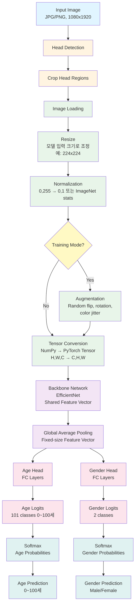
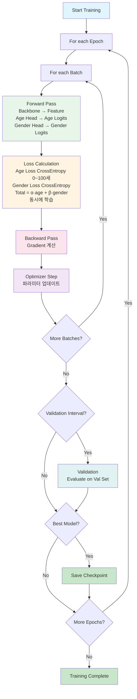
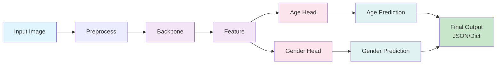

# Pipeline Diagram

## 전체 파이프라인 상세 다이어그램

```mermaid
graph TD
    A[Input Image<br/>JPG/PNG, 1080x1920] --> B[Head Detection]
    B --> C[Crop Head Regions]
    C --> D[Image Loading]
    D --> E[Resize<br/>모델 입력 크기로 조정<br/>예: 224x224]
    E --> F[Normalization<br/>0,255 → 0,1 또는 ImageNet stats]
    F --> G{Training Mode?}
    G -->|Yes| H[Augmentation<br/>Random flip, rotation,<br/>color jitter]
    G -->|No| I[Tensor Conversion<br/>NumPy → PyTorch Tensor<br/>H,W,C → C,H,W]
    H --> I
    I --> J[Backbone Network<br/>EfficientNet<br/>Shared Feature Vector]
    J --> K[Global Average Pooling<br/>Fixed-size Feature Vector]
    K --> L[Age Head<br/>FC Layers]
    K --> M[Gender Head<br/>FC Layers]
    L --> N[Age Logits<br/>101 classes 0~100세]
    M --> O[Gender Logits<br/>2 classes]
    N --> P[Softmax<br/>Age Probabilities]
    O --> Q[Softmax<br/>Gender Probabilities]
    P --> R[Age Prediction<br/>0~100세]
    Q --> S[Gender Prediction<br/>Male/Female]
    
    style A fill:#e1f5ff
    style B fill:#fff4e1
    style C fill:#fff4e1
    style D fill:#e8f5e9
    style E fill:#e8f5e9
    style F fill:#e8f5e9
    style G fill:#fff9c4
    style H fill:#e8f5e9
    style I fill:#e8f5e9
    style J fill:#f3e5f5
    style K fill:#f3e5f5
    style L fill:#fce4ec
    style M fill:#fce4ec
    style N fill:#fce4ec
    style O fill:#fce4ec
    style P fill:#e0f2f1
    style Q fill:#e0f2f1
    style R fill:#e0f2f1
    style S fill:#e0f2f1
```

## 학습 파이프라인

```mermaid
graph TD
    A[Start Training] --> B[For each Epoch]
    B --> C[For each Batch]
    C --> D[Forward Pass<br/>Backbone → Feature<br/>Age Head → Age Logits<br/>Gender Head → Gender Logits]
    D --> E[Loss Calculation<br/>Age Loss CrossEntropy 0~100세<br/>Gender Loss CrossEntropy<br/>Total = α·age + β·gender<br/>동시에 학습]
    E --> F[Backward Pass<br/>Gradient 계산]
    F --> G[Optimizer Step<br/>파라미터 업데이트]
    G --> H{More Batches?}
    H -->|Yes| C
    H -->|No| I{Validation Interval?}
    I -->|Yes| J[Validation<br/>Evaluate on Val Set]
    I -->|No| K{Best Model?}
    J --> K
    K -->|Yes| L[Save Checkpoint]
    K -->|No| M{More Epochs?}
    L --> M
    M -->|Yes| B
    M -->|No| N[Training Complete]
    
    style A fill:#e1f5ff
    style D fill:#e8f5e9
    style E fill:#fff4e1
    style F fill:#fce4ec
    style G fill:#f3e5f5
    style J fill:#e0f2f1
    style L fill:#c8e6c9
    style N fill:#c8e6c9
```

## 추론 파이프라인

```mermaid
graph LR
    A[Input Image] --> B[Preprocess]
    B --> C[Backbone]
    C --> D[Feature]
    D --> E[Age Head]
    D --> F[Gender Head]
    E --> G[Age Prediction]
    F --> H[Gender Prediction]
    G --> I[Final Output<br/>JSON/Dict]
    H --> I
    
    style A fill:#e1f5ff
    style C fill:#f3e5f5
    style D fill:#f3e5f5
    style E fill:#fce4ec
    style F fill:#fce4ec
    style G fill:#e0f2f1
    style H fill:#e0f2f1
    style I fill:#c8e6c9
```
