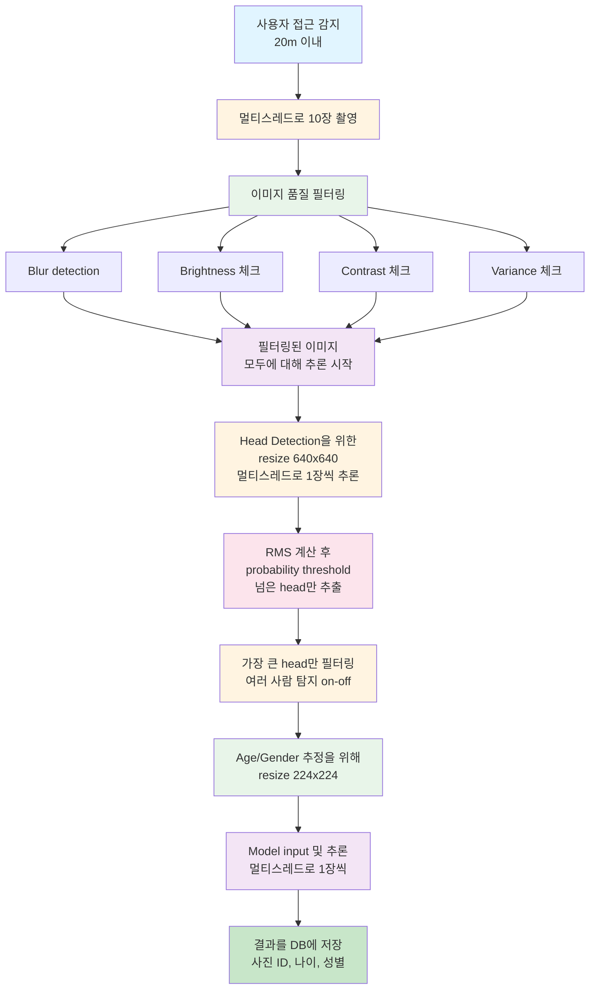

# Kiosk Service for Age & Gender Estimation

키오스크 환경에서 나이/성별 추정 서비스를 제공하는 모듈입니다.

## 개요

이 서비스는 실제 키오스크 환경에서 사용자를 감지하고, 멀티스레드로 여러 장의 사진을 촬영한 후, 이미지 품질 필터링, Head Detection, Age & Gender 추정을 수행하여 결과를 데이터베이스에 저장합니다.

## 주요 기능

### 1. 사용자 접근 감지
- 20m 이내 사용자 접근 감지
- 센서에서 값이 바로 넘어옴 (하드웨어 센서 직접 연결)
- 실제 환경에서는 거리 센서 또는 PIR 센서를 연결하여 사용

### 2. 멀티스레드 촬영
- 카메라가 항상 활성화되어 있음
- 사용자 감지 시 멀티스레드로 총 10장 촬영
- 빠른 연속 촬영으로 다양한 조건의 이미지 획득

### 3. 이미지 품질 필터링
- Blur detection (Laplacian variance 기반)
- Brightness 평가
- Contrast 평가
- 이상한 사진 자동 필터링 (빛 번짐, 초점 불안정 등)

### 4. 멀티스레드 추론
- 필터링된 이미지들을 멀티스레드로 병렬 처리
- 각 이미지마다 별도의 스레드에서 1장씩 추론 수행
- Head Detection부터 Age/Gender 추정까지 전체 파이프라인을 병렬 실행

### 5. Head Detection 및 필터링
- Head Detection을 위한 이미지 resize (640x640)
- RMS 계산 후 probability threshold를 넘은 head만 추출
- 가장 큰 head만 필터링 (여러 사람 탐지 on-off 가능)

### 6. Age & Gender 추정
- 가장 큰 head에서 Age & Gender 추정
- 모델 입력을 위한 resize (224x224)
- Multi-head 구조로 나이와 성별을 동시에 예측

### 7. 데이터베이스 저장
- 사진 ID, 나이, 성별을 DB에 저장
- SQLite 기반 (다른 DB로 확장 가능)
- 타임스탬프 및 메타데이터 포함

## 프로젝트 구조

```
service/
├── __init__.py              # 모듈 초기화
├── kiosk_service.py         # 메인 서비스 클래스
├── camera_handler.py        # 카메라 및 멀티스레드 촬영
├── image_quality.py         # 이미지 품질 필터링
├── database.py              # 데이터베이스 관리
└── README.md                # 이 파일
```

## 설치 및 설정

### 의존성

기본 프로젝트의 `requirements.txt`에 포함된 패키지 외에 추가로 필요한 것은 없습니다.

### 설정 파일

`configs/config.yaml`에 서비스 관련 설정을 추가할 수 있습니다:

```yaml
service:
  blur_threshold: 100.0        # Blur detection threshold
  brightness_min: 0.1          # 최소 밝기
  brightness_max: 0.9          # 최대 밝기
  contrast_min: 0.3            # 최소 대비
  detection_probability_threshold: 0.5  # Head detection probability threshold
  head_detection_size: [640, 640]       # Head detection용 resize 크기
  age_gender_input_size: [224, 224]     # Age/Gender 추정용 입력 크기
```

## 사용 방법

### 기본 사용

```python
from service import KioskService

# 서비스 인스턴스 생성
service = KioskService(
    config_path="configs/config.yaml",
    detection_model_path="weights/detection/best.pt",
    age_gender_weights="weights/best_model.pt",
    db_path="data/kiosk_results.db",
    camera_id=0,
    enable_multi_person=False,  # 단일 사람 모드
    detection_probability_threshold=0.5
)

# 서비스 시작
service.start_service()

# 서비스는 백그라운드에서 자동으로 동작
# - 사용자 접근 감지
# - 자동 촬영 및 처리
# - DB 저장

# 서비스 중지
service.stop_service()
```

### 단일 이미지 처리 (테스트용)

```python
# 단일 이미지 파일 처리
result = service.process_single_image_file(
    image_path="data/sample/test.jpg",
    save_to_db=True
)

if result:
    print(f"Age: {result['age']} (confidence: {result['age_confidence']:.3f})")
    print(f"Gender: {result['gender']} (confidence: {result['gender_confidence']:.3f})")
```

## 처리 파이프라인

### 전체 플로우

<div style="background-color: #f5f5f5; padding: 20px; border-radius: 8px; margin: 10px 0;">



</div>

### 상세 로직

#### 1. 사용자 접근 감지

```python
# 20m 이내 접근 감지 (센서에서 값이 바로 넘어옴)
if simulate_distance_sensor():
    # 실제 환경에서는 하드웨어 센서에서 값이 바로 전달됨
    # distance = read_distance_sensor()
    # if distance < 20.0:
    
    # 촬영 및 처리 시작
    _process_user_session()
```

#### 2. 멀티스레드 촬영

```python
# 10장 연속 촬영
captured_images = camera_handler.capture_multiple_simple(
    num_images=10,
    interval=0.1  # 0.1초 간격
)
```

#### 3. 이미지 품질 필터링

```python
# 품질 평가 및 필터링
filtered_images, quality_scores = image_quality_filter.filter_images(
    captured_images,
    return_scores=True
)

# 평가 항목:
# - blur_score: Laplacian variance (높을수록 선명)
# - brightness: 평균 밝기 (0.0 ~ 1.0)
# - contrast: 표준편차 기반 대비 (0.0 ~ 1.0)
# - variance: 이미지 분산
```

#### 4. 멀티스레드 추론 (각 이미지 1장씩)

필터링된 이미지들은 멀티스레드로 병렬 처리됩니다. 각 이미지마다 별도의 스레드가 할당되어 Head Detection부터 Age/Gender 추정까지 전체 파이프라인을 수행합니다.

```python
# 멀티스레드로 각 이미지 추론 (1장씩)
def inference_worker(image, idx):
    """개별 이미지 추론 워커"""
    result = _process_single_image(image, idx)
    if result:
        with results_lock:
            all_results.append(result)

# 각 이미지마다 스레드 생성
for idx, image in enumerate(filtered_images):
    thread = threading.Thread(target=inference_worker, args=(image, idx))
    thread.start()
    inference_threads.append(thread)

# 모든 추론 완료 대기
for thread in inference_threads:
    thread.join()
```

#### 5. Head Detection 및 필터링 (각 이미지별)

각 스레드에서 수행되는 단일 이미지 처리:

```python
# Detection을 위한 resize
detection_image = image.resize((640, 640))

# Head Detection
detection_result = detection_model.predict(detection_image)

# RMS 계산 (confidence score 기반)
for box, score in zip(detection_result['boxes'], detection_result['scores']):
    rms_score = sqrt(mean(score^2))
    
    if rms_score >= probability_threshold:
        # Valid head
        valid_heads.append({'box': box, 'score': rms_score, 'area': ...})

# 가장 큰 head 선택 (단일 사람 모드)
if not enable_multi_person:
    selected_head = max(valid_heads, key=lambda h: h['area'])
```

#### 6. Age & Gender 추정 (각 이미지별)

```python
# Head crop 및 resize
head_crop = image.crop(head_bbox)
head_resized = head_crop.resize((224, 224))

# Model input
image_tensor = transform(head_resized)

# 추론
predictions = age_gender_model.predict(image_tensor)

# 결과
age = predictions['age']['predicted_age'][0]
gender = class_to_gender(predictions['gender']['predicted_class'][0])
```

#### 7. DB 저장

```python
# 고유 이미지 ID 생성
image_id = f"{timestamp}_{uuid}"

# DB 저장
db_manager.save_result(
    image_id=image_id,
    age=age,
    gender=gender,
    gender_confidence=gender_conf,
    age_confidence=age_conf,
    head_bbox=bbox,
    detection_confidence=det_conf
)
```

## 모듈 상세 설명

### KioskService

메인 서비스 클래스로 전체 파이프라인을 관리합니다.

**주요 메서드:**
- `start_service()`: 서비스 시작
- `stop_service()`: 서비스 중지
- `process_single_image_file()`: 단일 이미지 처리 (테스트용)

### CameraHandler

카메라 제어 및 멀티스레드 촬영을 담당합니다.

**주요 메서드:**
- `start()`: 카메라 시작
- `stop()`: 카메라 중지
- `capture_multiple_simple()`: 여러 장 촬영
- `get_latest_frame()`: 최신 프레임 가져오기

### ImageQualityFilter

이미지 품질 평가 및 필터링을 담당합니다.

**주요 메서드:**
- `evaluate_quality()`: 이미지 품질 평가
- `filter_images()`: 이미지 리스트 필터링
- `is_blurry()`: Blur 여부 확인
- `is_brightness_acceptable()`: 밝기 적절 여부 확인

### DatabaseManager

데이터베이스 저장 및 조회를 담당합니다.

**주요 메서드:**
- `save_result()`: 결과 저장
- `get_result()`: 결과 조회
- `get_results()`: 시간 범위로 결과 조회

## 데이터베이스 스키마

```sql
CREATE TABLE inference_results (
    id INTEGER PRIMARY KEY AUTOINCREMENT,
    image_id TEXT NOT NULL,
    timestamp DATETIME NOT NULL,
    age INTEGER,
    gender TEXT,
    gender_confidence REAL,
    age_confidence REAL,
    head_bbox TEXT,  -- JSON format: [x1, y1, x2, y2]
    detection_confidence REAL,
    image_path TEXT,
    metadata TEXT,   -- JSON format
    created_at DATETIME DEFAULT CURRENT_TIMESTAMP
);

CREATE INDEX idx_image_id ON inference_results(image_id);
CREATE INDEX idx_timestamp ON inference_results(timestamp);
```

## 설정 옵션

### KioskService 파라미터

- `config_path`: 설정 파일 경로
- `detection_model_path`: Head detection 모델 경로
- `age_gender_weights`: Age/Gender 모델 가중치 경로
- `db_path`: 데이터베이스 파일 경로
- `camera_id`: 카메라 ID (기본값: 0)
- `enable_multi_person`: 여러 사람 탐지 활성화 여부 (기본값: False)
- `detection_probability_threshold`: Head detection probability threshold (기본값: 0.5)
- `head_detection_size`: Head detection용 resize 크기 (기본값: (640, 640))
- `age_gender_input_size`: Age/Gender 추정용 입력 크기 (기본값: (224, 224))

### 이미지 품질 필터 설정

- `blur_threshold`: Blur detection threshold (기본값: 100.0)
- `brightness_min`: 최소 밝기 (기본값: 0.1)
- `brightness_max`: 최대 밝기 (기본값: 0.9)
- `contrast_min`: 최소 대비 (기본값: 0.3)
- `variance_threshold`: 이미지 분산 threshold (기본값: 10.0)

## 실제 환경 통합

### 거리 센서 연결

실제 키오스크 환경에서는 하드웨어 거리 센서를 연결해야 합니다:

```python
# service/camera_handler.py의 simulate_distance_sensor() 함수 수정

def read_distance_sensor() -> float:
    """
    실제 거리 센서에서 거리 읽기
    
    Returns:
        거리 (미터)
    """
    # 실제 센서 통신 코드
    # 예: GPIO, I2C, UART 등을 통한 센서 읽기
    distance = your_sensor.read()
    return distance

def simulate_distance_sensor() -> bool:
    """20m 이내 접근 감지"""
    distance = read_distance_sensor()
    return distance < 20.0
```

### 카메라 설정

실제 환경에 맞게 카메라 설정을 조정할 수 있습니다:

```python
camera_handler = CameraHandler(
    camera_id=0,
    width=1920,    # 해상도 조정
    height=1080,
    fps=30         # FPS 조정
)
```
