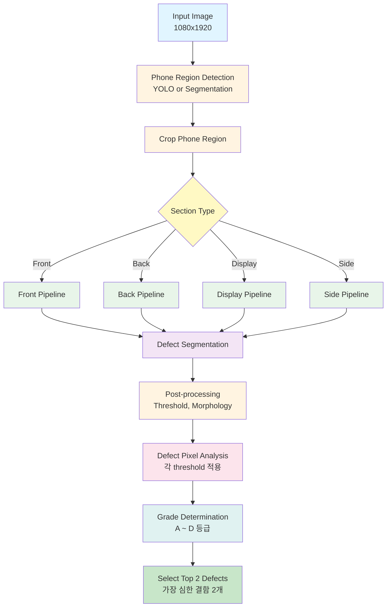
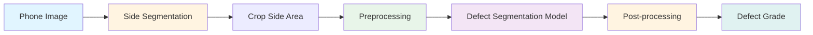
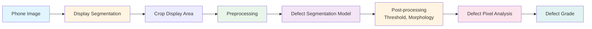

# Phone Defect Detection System

## 프로젝트 개요

이 프로젝트는 중고 스마트폰 자동 외관 검사 시스템의 포트폴리오 버전입니다.
해당 프로젝트에서 디스플레이, 측면 개발을 맡았습니다.

**중요**: 이 프로젝트는 실제 상용 코드, 데이터, 모델을 포함하지 않으며, 구조와 아이디어만 참고하여 완전히 새로 구현되었습니다.

## Task 정의

이 시스템은 다음과 같은 파이프라인을 가집니다:

1. **Phone Region Detection**: 입력 이미지(1080x1920)에서 휴대폰 영역 검출 (Detection 또는 Segmentation)
2. **Defect Segmentation**: 검출된 영역에서 결함 영역 Segmentation
3. **Defect Classification**: 검출된 segmentation pixel을 통해 결함 여부 결정 (각 threshold 적용)
4. **Grade Selection**: 가장 심한 결함 2개 선정

각 영역(전면, 후면, 디스플레이, 측면)별로 독립적인 모델과 파이프라인을 가집니다.

## 전체 파이프라인



## 영역별 파이프라인

### 측면 (Side)



### 디스플레이 (Display)



## 모델 구조 요약

### Phone Region Detection

- **YOLO**: 측면 버튼과 디스플레이 휴대폰 및 결함 검출
- **Segmentation**: 측면 휴대폰 영역 및 결함 검출, 디스플레이 결함 영역 검출

### Defect Segmentation Model

- **Backbone**: EfficientNet 또는 ResNet 기반 feature extractor
- **Neck**: U-Net style decoder
- **Head**: Multi-class segmentation head
- **Output**: Pixel-level defect classification

### 결함 등급 시스템

- **A**: 정상 (No defect)
- **B**: 경미한 결함 (Minor defect)
- **C**: 중간 결함 (Moderate defect)
- **D**: 심한 결함 (Severe defect)

각 등급은 pixel count, area, length 등의 threshold로 결정됩니다.

## 데이터 구성 방식

### 데이터셋 구조

```
data/
├── README.md          # 데이터 사용 방법 설명
└── sample/           # 예시용 샘플 이미지
    ├── images/       # 원본 이미지 (1080x1920)
    └── annotations/  # 라벨 파일
        ├── phone_detection/  # 휴대폰 영역 검출 라벨
        └── defect_segmentation/  # 결함 segmentation 라벨
```

### 데이터 형식

- **이미지**: JPG, PNG 형식, 1080x1920 해상도
- **Phone Detection Annotation**: YOLO format, COCO format
- **Defect Segmentation Annotation**: Segmentation mask (각 pixel이 등급을 나타냄)

## 설치 및 환경 설정

### 요구사항

- Python 3.10+
- PyTorch 1.12+
- CUDA (GPU 사용 시, 선택사항)
- Ultralytics YOLO

### 설치

```bash
# 저장소 클론
git clone <repository-url>
cd phone_detect

# 가상환경 생성 (권장)
python -m venv venv
source venv/bin/activate  # Windows: venv\Scripts\activate

# 의존성 설치
pip install -r requirements.txt
```

## 사용 예시

### 학습 (Training)

```bash
# Phone Detection 모델 학습
python train_phone_detection.py --config configs/config.yaml --section front

# Defect Segmentation 모델 학습
python train_defect_segmentation.py --config configs/config.yaml --section display
```

### 추론 (Inference)

```bash
# 디스플레이 결함 검출
python inference.py --image path/to/image.jpg --section display --weights weights/display_best.pt

# 측면 결함 검출
python inference.py --image path/to/image.jpg --section side --weights weights/side_best.pt

# 전체 파이프라인 (모든 영역)
python inference.py --image path/to/image.jpg --all-sections
```

### 평가 (Evaluation)

```bash
# 검증 데이터셋으로 평가
python evaluation.py --config configs/config.yaml --weights weights/best.pt --section display

# 결함 등급별 정확도 출력
python evaluation.py --config configs/config.yaml --weights weights/best.pt --section display --metrics grade_accuracy
```

## 설정 파일

모든 하이퍼파라미터와 경로 설정은 `configs/config.yaml`에서 관리됩니다.

주요 설정 항목:
- 각 영역별 모델 구조 (backbone, decoder)
- 학습 파라미터 (batch_size, learning_rate, epochs)
- 데이터 경로
- 입력 이미지 크기 (영역별로 다름)
- 전처리/후처리 설정 (CLAHE, threshold, morphology)
- 결함 등급 threshold

## 프로젝트 구조

```
phone_detect/
├── README.md                 # 프로젝트 개요 및 사용법
├── requirements.txt          # Python 패키지 의존성
├── configs/
│   └── config.yaml          # 설정 파일
├── data/
│   ├── README.md            # 데이터 사용 방법
│   └── sample/              # 예시 샘플 이미지
├── models/
│   ├── __init__.py
│   ├── phone_detector.py    # 휴대폰 영역 검출 모델 (YOLO wrapper)
│   ├── phone_segmenter.py   # 휴대폰 영역 Segmentation 모델
│   ├── defect_segmenter.py  # 결함 Segmentation 모델
│   └── utils.py             # 모델 유틸리티 함수
├── preprocess/
│   ├── phone_detection.py   # 휴대폰 영역 검출 전처리
│   ├── defect_preprocess.py # 결함 전처리 (CLAHE 등)
│   └── defect_postprocess.py # 결함 후처리 (threshold, morphology)
├── inference/
│   ├── __init__.py
│   ├── display.py           # 디스플레이 추론 파이프라인
│   ├── side.py              # 측면 추론 파이프라인
│   └── base.py              # 기본 추론 클래스
├── utils/
│   ├── defect_grade.py      # 결함 등급 결정 및 선정
│   └── visualization.py     # 결과 시각화
├── train_phone_detection.py  # 휴대폰 영역 검출 학습
├── train_defect_segmentation.py  # 결함 Segmentation 학습
├── inference.py             # 통합 추론 스크립트
├── evaluation.py            # 평가 스크립트
└── docs/
    ├── pipeline_diagram.md  # 파이프라인 상세 다이어그램
    └── notes.md             # 개발 노트 및 설계 의도
```

## Legal Notice

**중요**: 이 프로젝트는 실제 상용 코드, 데이터, 모델을 포함하지 않습니다. 모든 코드, 모델 구조, 설정은 포트폴리오 목적으로 새로 작성되었으며, 실제 상용 시스템과의 유사성은 구조적 아이디어에 한정됩니다.
