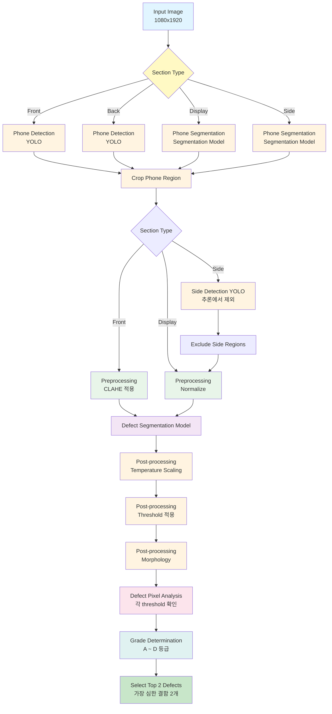
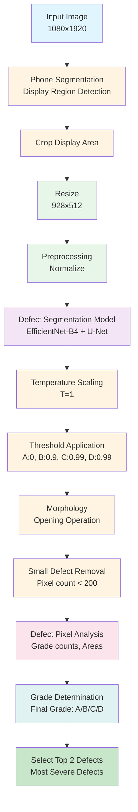
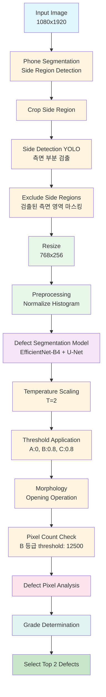
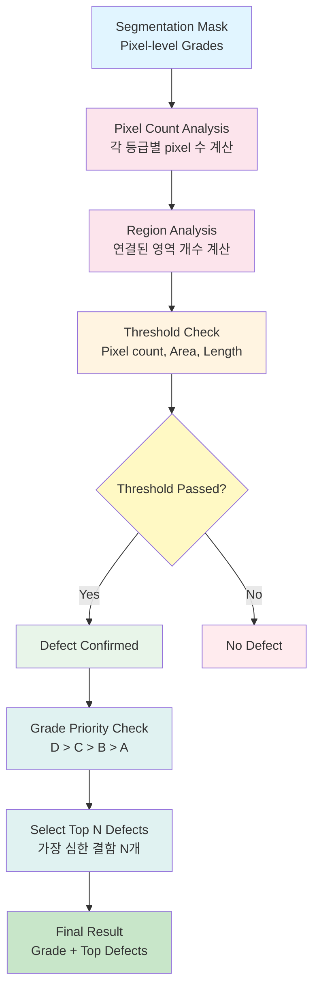

# Pipeline Diagram

## 전체 파이프라인 상세 다이어그램

```mermaid
graph TD
    A[Input Image<br/>1080x1920] --> B{Section Type}
    B -->|Front| C[Phone Detection<br/>YOLO]
    B -->|Back| D[Phone Detection<br/>YOLO]
    B -->|Display| E[Phone Segmentation<br/>Segmentation Model]
    B -->|Side| F[Phone Segmentation<br/>Segmentation Model]
    
    C --> G[Crop Phone Region]
    D --> G
    E --> G
    F --> G
    
    G --> H{Section Type}
    H -->|Front| I[Preprocessing<br/>CLAHE 적용]
    H -->|Display| J[Preprocessing<br/>Normalize]
    H -->|Side| K[Side Detection YOLO<br/>추론에서 제외]
    
    K --> L[Exclude Side Regions]
    L --> J
    I --> M[Defect Segmentation Model]
    J --> M
    
    M --> N[Post-processing<br/>Temperature Scaling]
    N --> O[Post-processing<br/>Threshold 적용]
    O --> P[Post-processing<br/>Morphology]
    P --> Q[Defect Pixel Analysis<br/>각 threshold 확인]
    Q --> R[Grade Determination<br/>A ~ D 등급]
    R --> S[Select Top 2 Defects<br/>가장 심한 결함 2개]
    
    style A fill:#e1f5ff
    style B fill:#fff9c4
    style C fill:#fff4e1
    style D fill:#fff4e1
    style E fill:#fff4e1
    style F fill:#fff4e1
    style G fill:#fff4e1
    style I fill:#e8f5e9
    style J fill:#e8f5e9
    style K fill:#fff4e1
    style M fill:#f3e5f5
    style N fill:#fff4e1
    style O fill:#fff4e1
    style P fill:#fff4e1
    style Q fill:#fce4ec
    style R fill:#e0f2f1
    style S fill:#c8e6c9
```

## 디스플레이 파이프라인 상세

```mermaid
graph TD
    A[Input Image<br/>1080x1920] --> B[Phone Segmentation<br/>Display Region Detection]
    B --> C[Crop Display Area]
    C --> D[Resize<br/>928x512]
    D --> E[Preprocessing<br/>Normalize]
    E --> F[Defect Segmentation Model<br/>EfficientNet-B4 + U-Net]
    F --> G[Temperature Scaling<br/>T=1]
    G --> H[Threshold Application<br/>A:0, B:0.9, C:0.99, D:0.99]
    H --> I[Morphology<br/>Opening Operation]
    I --> J[Small Defect Removal<br/>Pixel count < 200]
    J --> K[Defect Pixel Analysis<br/>Grade counts, Areas]
    K --> L[Grade Determination<br/>Final Grade: A/B/C/D]
    L --> M[Select Top 2 Defects<br/>Most Severe Defects]
    
    style A fill:#e1f5ff
    style B fill:#fff4e1
    style C fill:#fff4e1
    style D fill:#e8f5e9
    style E fill:#e8f5e9
    style F fill:#f3e5f5
    style G fill:#fff4e1
    style H fill:#fff4e1
    style I fill:#fff4e1
    style J fill:#fff4e1
    style K fill:#fce4ec
    style L fill:#e0f2f1
    style M fill:#c8e6c9
```

## 측면 파이프라인 상세

```mermaid
graph TD
    A[Input Image<br/>1080x1920] --> B[Phone Segmentation<br/>Side Region Detection]
    B --> C[Crop Side Region]
    C --> D[Side Detection YOLO<br/>측면 부분 검출]
    D --> E[Exclude Side Regions<br/>검출된 측면 영역 마스킹]
    E --> F[Resize<br/>768x256]
    F --> G[Preprocessing<br/>Normalize Histogram]
    G --> H[Defect Segmentation Model<br/>EfficientNet-B4 + U-Net]
    H --> I[Temperature Scaling<br/>T=2]
    I --> J[Threshold Application<br/>A:0, B:0.8, C:0.8]
    J --> K[Morphology<br/>Opening Operation]
    K --> L[Pixel Count Check<br/>B 등급 threshold: 12500]
    L --> M[Defect Pixel Analysis]
    M --> N[Grade Determination]
    N --> O[Select Top 2 Defects]
    
    style A fill:#e1f5ff
    style B fill:#fff4e1
    style C fill:#fff4e1
    style D fill:#fff4e1
    style E fill:#fff4e1
    style F fill:#e8f5e9
    style G fill:#e8f5e9
    style H fill:#f3e5f5
    style I fill:#fff4e1
    style J fill:#fff4e1
    style K fill:#fff4e1
    style L fill:#fff4e1
    style M fill:#fce4ec
    style N fill:#e0f2f1
    style O fill:#c8e6c9
```

## 결함 등급 결정 프로세스

```mermaid
graph TD
    A[Segmentation Mask<br/>Pixel-level Grades] --> B[Pixel Count Analysis<br/>각 등급별 pixel 수 계산]
    B --> C[Region Analysis<br/>연결된 영역 개수 계산]
    C --> D[Threshold Check<br/>Pixel count, Area, Length]
    D --> E{Threshold Passed?}
    E -->|Yes| F[Defect Confirmed]
    E -->|No| G[No Defect]
    F --> H[Grade Priority Check<br/>D > C > B > A]
    H --> I[Select Top N Defects<br/>가장 심한 결함 N개]
    I --> J[Final Result<br/>Grade + Top Defects]
    
    style A fill:#e1f5ff
    style B fill:#fce4ec
    style C fill:#fce4ec
    style D fill:#fff4e1
    style E fill:#fff9c4
    style F fill:#e8f5e9
    style G fill:#ffebee
    style H fill:#e0f2f1
    style I fill:#e0f2f1
    style J fill:#c8e6c9
```
